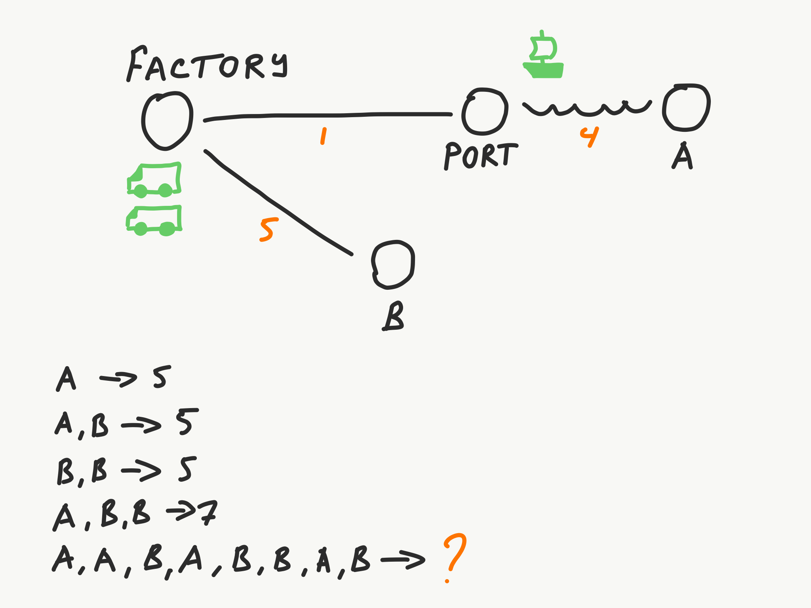

[Back to index](../README.md)

# Exercise 1

There is a map containing a Factory, Port, Warehouse A and Warehouse B. Factory has a small stock of containers that
have to be delivered to these warehouses.

There are **two trucks and one ship that can carry one container at a time** (trucks start at Factory, ship starts at
the Port).

**Traveling takes a specific amount of hours** (represented by an orange number). Time is needed to travel in one
direction, you also spend the same amount of time to come back. For example, it takes 5 hours for a truck to travel from
the Factory to B.

Transport follows a simple heuristic: **pick the first container from the location** (first-in, first - out), bring it
to the designation, then come back home.

Truck that drops off cargo at the Port doesn't need to wait for the ship (there is a small warehouse buffer there). It
can drop the cargo and start heading back. Cargo loading and unloading is an instant operation.

Transport moves *in parallel*. First truck might be bringing container to a location A, while the second truck comes
back from A, while ship travels back to the Port.

## Task

**Task**: write a program that takes a list of cargos from the command line and prints out the number of hours that it
would take to get them delivered.

| Input        | Output |
|--------------|--------|
| A            | 5      |
| AB           | 5      |
| BB           | 5      |
| ABB          | 7      |
| AABABBAB     | ?      |
| ABBBABAAABBB | ?      |
